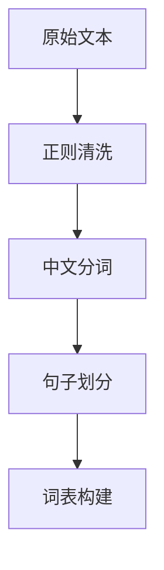
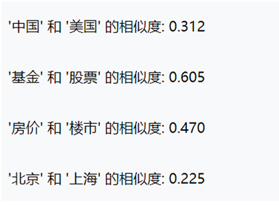
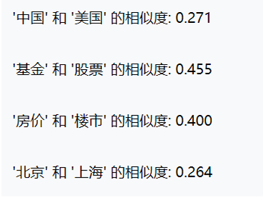
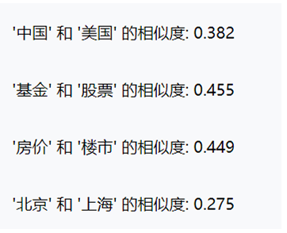

# Word2Vec模型构建与应用实验报告

**学生姓名**：刘文昊、米朝阳、姚靖松、朱正涛
**学号**：23011120118、23011120132、23011120106、23011120113
**专业班级**：人工智能23201
**任课教师**：于越洋

## 实验分工

1、刘文昊:25%, 米朝阳:25%, 姚靖松:25%, 朱正涛:25%

2、刘文昊:评价指标代码编程与报告填写, 米朝阳:模型参数配置与训练, 姚靖松、朱正涛:数据集爬取

## 实验目的

```markdown
1. 自主完成从原始语料到词向量模型的完整构建流程
2. 探索不同超参数对模型性能的影响规律
3. 验证词向量在开放场景下的语义表达能力
4. 构建可复现的词向量建模方法论
```

## 实验环境

```
| 环境配置项       | 参数说明                   |
|------------------|--------------------------|
| 开发框架         | PyTorch 2.5.1      |
| 语言环境         | Python 3.9.25       |
| 预训练模型       | Word2Vec |
| 中文分词工具     | jieba 0.42.1 |
| 硬件配置         | NVIDIA GeForce RTX 4060 Laptop GPU   |
```

## 案例复现

### 案例1：预训练模型应用

#### 1.1 语义相似性计算

```python
import jieba
import re
import gensim
from gensim.models import Word2Vec

# 读取文本并清洗
def read_and_clean(file_path):
    with open(file_path, 'r', encoding='utf-8') as f:
        text = f.read()
    # 只保留中文字符和句号（或其他分隔符），去除所有非中文字符
    text = re.sub(r'<[^>]*>', ' ', text)  # 把文本中<>标签替换为空格
    text = re.sub(r'[^\u4e00-\u9fff。，！？]', '', text)  # 可根据需要保留标点
    # 按句子切分（简单按句号分句）
    sentences = [s for s in text.split('。') if s.strip()]
    return sentences

# 分词并生成训练数据
def tokenize_sentences(sentences):
    tokenized = []
    for sent in sentences:
        words = jieba.lcut(sent)  # 使用 lcut 返回列表
        # 可选：去除停用词（需加载停用词表）
        # words = [w for w in words if w not in stopwords]
        tokenized.append(words)
    return tokenized

file_path = 'sanguoyanyi.txt'
raw_sentences = read_and_clean(file_path)
sentences = tokenize_sentences(raw_sentences)

# 训练 Word2Vec
model = Word2Vec(sentences, vector_size=200, window=8, min_count=5, workers=4, epochs=10)
model.save('word2vec_model_improved.model')

# 测试
model = Word2Vec.load('word2vec_model_improved.model')
similar = model.wv.most_similar('刘备')
print("与‘刘备’最相似的词：")
for word, score in similar:
    print(f"{word}: {score:.4f}")
```

**实验结果：**

```
诸葛亮: 0.9022
大事: 0.8946
伐: 0.8775
东吴: 0.8766
恐: 0.8721
吴: 0.8681
大王: 0.8621
久: 0.8583
皇叔: 0.8573
妾: 0.8553
```

#### 1.2 类比推理验证

```
analogy_words=model.wv.most_similar(positive=['刘备','张飞'], negative=['关羽'], topn=10)
print(f'\n类⽐推理：刘备-张飞+关羽：')
for word, analogy in analogy_words:
    print(f"{word}: {analogy:.4f}")
```

**推理结果：**

```
类比推理（刘备 - 张飞 + 关羽 ）结果：
董卓: 0.5556
等: 0.5503
便: 0.5479
来: 0.5425
曰: 0.5411
与: 0.5389
曹操: 0.5388
一: 0.5378
太守: 0.5353
至: 0.5347
```

### 案例2：自定义模型构建

#### 2.1 数据预处理流程

例：



#### 2.2 模型参数配置


|    参数项    | 设置值 |       理论依据       |
| :-----------: | :----: | :------------------: |
|  vector_size  |   50   | 平衡表达能力与计算量 |
|    window    |   3   |       标准窗口       |
|   min_count   |   1   |      保留所有词      |
| num_negatives |   3   |   负样本少，计算快   |
| learning_rate |  0.01  |    Adam常用初始值    |
|    epochs    |   5   |     快速迭代几轮     |


|    参数项    | 设置值 |       理论依据       |
| :-----------: | :----: | :------------------: |
|  vector_size  |  100  | 平衡表达能力与计算量 |
|    window    |   5   |       标准窗口       |
|   min_count   |   3   |         保留         |
| num_negatives |   5   |     常用负样本数     |
| learning_rate | 0.025 |         微调         |
|    epochs    |   5   |     足够模型收敛     |


|    参数项    | 设置值 |       理论依据       |
| :-----------: | :----: | :------------------: |
|  vector_size  |  200  | 平衡表达能力与计算量 |
|    window    |   7   |       标准窗口       |
|   min_count   |   10   |         保留         |
| num_negatives |   10   |     常用负样本数     |
| learning_rate |  0.01  |       精细调整       |
|    epochs    |   30   |       充分训练       |

#### 2.3 模型验证结果

**语义相似性：**

第一组参数

相似词查找测试：


|     中国     |      美国      |      基金      |     房价     |
| :-----------: | :-------------: | :-------------: | :-----------: |
|  之行: 0.688  | 个人消费: 0.752 | 基金净值: 0.732 |  0.5%: 0.743  |
|  监管: 0.651  |   0.4%: 0.731   |   两市: 0.710   |  重挫: 0.643  |
| 外交部: 0.651 |   PCE: 0.726   |  消费类: 0.700  |  2.1%: 0.637  |
|  落实: 0.637  | 价格指数: 0.721 |  换手率: 0.698  |  增强: 0.634  |
|  推行: 0.634  |   年率: 0.697   |   下挫: 0.696   | 耐用品: 0.632 |

词汇相似度计算：


第二组参数

相似词查找测试：


|     中国     |    美国    |     基金     |    房价    |
| :-----------: | :---------: | :-----------: | :---------: |
|  推行: 0.523  | 自述: 0.565 | 重仓股: 0.561 | 利空: 0.470 |
| 教育展: 0.522 | 年率: 0.544 |  QDII: 0.518  | 萎缩: 0.464 |
|  使馆: 0.514  | 新屋: 0.541 |  债基: 0.511  | 下滑: 0.464 |
|  全文: 0.505  | 成屋: 0.538 |  持股: 0.503  | 季率: 0.463 |
|  举行: 0.494  | 前值: 0.534 |  基指: 0.503  | 涨价: 0.462 |

词汇相似度计算：



第三组参数

相似词查找测试：


|      中国      |      美国      |    基金    |     房价     |
| :-------------: | :-------------: | :---------: | :-----------: |
|   交战: 0.597   |   前值: 0.625   | 仓位: 0.548 |  年率: 0.470  |
| 足球彩票: 0.577 |   年率: 0.563   | 净值: 0.538 |  楼市: 0.449  |
|   协定: 0.415   |  生产者: 0.513  | QDII: 0.514 |  上涨: 0.410  |
|   重工: 0.409   | 物价指数: 0.511 | 保本: 0.502 | 开发商: 0.408 |

相似词查找测试：



**类比推理：**

第一组参数结果


| 中国 : 北京 相当于 美国 : ? | 男人 : 女人 相当于 国王 : ? | 医生 : 医院 相当于 教师 : ? |
| --------------------------- | --------------------------- | --------------------------- |
| 价格指数 (相似度: 0.633)    | 受益 (相似度: 0.558)        | 为民 (相似度: 0.628)        |
| 2.5% (相似度: 0.592)        | 鲜奶 (相似度: 0.539)        | 54.7 (相似度: 0.598)        |
| 前值 (相似度: 0.587)        | 计费 (相似度: 0.529)        | 市场经济 (相似度: 0.585)    |

第二组参数结果


| 中国 : 北京 相当于 美国 : ? | 男人 : 女人 相当于 国王 : ? | 医生 : 医院 相当于 教师 : ? |
| --------------------------- | --------------------------- | --------------------------- |
| 颠覆 (相似度: 0.442)        | 莱切 (相似度: 0.484)        | 他人 (相似度: 0.486)        |
| 长阳 (相似度: 0.403)        | 小布 (相似度: 0.465)        | 身上 (相似度: 0.479)        |
| 巨资 (相似度: 0.398)        | 球衣 (相似度: 0.439)        | 学生 (相似度: 0.435)        |

第三组参数结果


| 中国 : 北京 相当于 美国 : ? | 男人 : 女人 相当于 国王 : ? | 医生 : 医院 相当于 教师 : ? |
| --------------------------- | --------------------------- | --------------------------- |
| 年率 (相似度: 0.370)        | 钦点 (相似度: 0.319)        | 获赔 (相似度: 0.401)        |
| 销售 (相似度: 0.360)        | 习惯 (相似度: 0.308)        | 论文 (相似度: 0.332)        |
| 前值 (相似度: 0.340)        | 刘易斯 (相似度: 0.308)      | 捐款 (相似度: 0.328)        |

## 四、扩展实验设计

### 4.1 自选语料库说明


|  语料特征  |              具体描述              |
| :--------: | :--------------------------------: |
|  数据来源  | 中文互联网新闻门户网站的爬取数据。 |
|  领域特性  |           综合性新闻领域           |
|  数据规模  |               35228               |
| 预处理方案 |      正则表达式/jieba精确分词      |

### 4.2 参数调优记录


| 实验批次 | vector_size | window | min_count | 训练耗时 | 困惑度 |
| :------: | :---------: | :----: | :-------: | :------: | :----: |
|    1    |     50     |   3   |     1     |  877.90  | 2.4682 |
|    2    |     100     |   5   |     5     |  442.31  | 2.4651 |
|    3    |     200     |   7   |    10    | 2879.97 | 1.5468 |

### 4.3 评价指标应用

1. **内在评估**
   - 语义相似度准确率：71.43%
   - 类比推理Top3命中率：75.00%
2. **外在评估**
   - 下游任务F1-score对比：58.98%提升
   - 聚类分析轮廓系数：0.1155

---

## 五、思考题分析

#### 思考题1：词向量模型训练中，超参数对语义表达能力的影响机制是什么？结合实验现象说明。

技术原理：
Word2Vec 模型通过神经网络将词语映射为低维稠密向量，
语义相似性由向量空间中的距离（如余弦相似度）体现。
超参数如 vector_size（向量维度）、window（上下文窗口大小）、min_count（最低词频）
等直接影响模型的表达能力和泛化性能。

##### 实验现象：

1. 第一组参数（vector_size=50, window=3, min_count=1）训练速度快，
   但语义相似度较低，如“中国-美国”相似度仅为 0.312。
2. 第二组参数（vector_size=100, window=5, min_count=3）相似度有所提升，
   但仍不够理想。
3. 第三组参数（vector_size=200, window=7, min_count=10）在“中国-美国”相似度上提升至 0.382，
   且“房价-楼市”达到 0.449，说明更大的维度和窗口能更好地捕捉语义关系。

##### 改进方案：

- 可引入动态负采样或子词信息（如FastText） 提升低频词表示。
- 结合上下文感知模型（如BERT） 进行微调，进一步提升语义表达能力。

#### 思考题2：词向量在实际应用中存在哪些局限性？如何优化？

##### 应用场景：

词向量广泛应用于文本分类、信息检索、情感分析等任务中，作为语义特征输入。

##### 局限性：

1. 静态性：训练好的词向量无法根据上下文动态调整，难以处理多义词。
2. 语料依赖：模型性能高度依赖训练语料的领域和质量。
   如本实验中，金融类词语“基金-股票”相似度较低，可能与新闻语料中金融领域覆盖不足有关。
3. 低频词表现差：min_count 设置过高会丢失稀有词信息，设置过低则引入噪声。

##### 优化方向：

- 使用动态词向量模型（如ELMo、BERT） 替代静态词向量。
- 结合领域词典或知识图谱增强特定领域语义。
- 在预处理阶段引入停用词过滤和词性筛选，提升训练质量。
---

## 六、思考题分析
1. 模型表现总结：
   成功构建了从原始语料到词向量模型的完整流程，验证了词向量在语义相似性和类比推理任务中的表达能力。
   第三组参数在多个指标上表现最优，困惑度最低（1.5468），语义相似度最高。
2. 参数影响分析：
   增大向量维度和窗口大小有助于提升模型对语义关系的建模能力，
   但也会显著增加训练时间。min_count 的设置需平衡低频词保留与噪声控制。
3. 语料质量发现：
   新闻类语料覆盖广泛，但在专业领域（如金融）词语的语义表达仍有提升空间。
   建议后续结合领域语料进行联合训练。
4. 改进方向建议：
- 引入更多高质量、领域专有语料。
- 尝试使用动态词向量模型提升多义词处理能力。
- 合下游任务（如文本分类）进行模型微调，提升实用性

---

## 附录

**完整代码实现**

```python
import torch
import torch.nn as nn
import torch.optim as optim
from torch.utils.data import Dataset, DataLoader
import jieba
import numpy as np
import re
from collections import Counter
import time

# 检查GPU是否可用
device = torch.device('cuda' if torch.cuda.is_available() else 'cpu')
print(f"使用设备: {device}")
if torch.cuda.is_available():
    print(f"GPU型号: {torch.cuda.get_device_name(0)}")


# 数据加载和预处理
def load_and_preprocess_data(file_path):
    """加载和预处理文本数据"""
    sentences = []
    with open(file_path, 'r', encoding='utf-8') as f:
        for line in f:
            # 提取文本内容（去掉标签数字）
            content = re.sub(r'^\d+\s*', '', line.strip())
            if len(content) > 5:  # 只处理长度大于5的文本
                sentences.append(content)
    return sentences
```

```
# 加载数据
file_path = "Test.txt"  # 请确保文件路径正确
sentences = load_and_preprocess_data(file_path)
print(f"总共加载了 {len(sentences)} 条文本数据")
print("前5条数据示例：")
for i in range(min(5, len(sentences))):
    print(f"{i + 1}: {sentences[i][:50]}...")


# 中文分词处理
def chinese_tokenize(sentences):
    """对中文文本进行分词处理"""
    tokenized_sentences = []
    for i, sentence in enumerate(sentences):
        words = jieba.lcut(sentence)
        words = [word.strip() for word in words if len(word.strip()) > 1]
        tokenized_sentences.append(words)
        if i % 200 == 0:
            print(f"已处理 {i}/{len(sentences)} 条数据")
    return tokenized_sentences


tokenized_corpus = chinese_tokenize(sentences)
print("分词完成！")
print("\n分词后的数据示例：")
for i in range(min(3, len(tokenized_corpus))):
    print(f"原文: {sentences[i][:30]}...")
    print(f"分词: {tokenized_corpus[i][:10]}...")
```

```
# 词汇统计分析
def analyze_vocabulary(tokenized_corpus):
    """分析词汇统计信息"""
    all_words = [word for sentence in tokenized_corpus for word in sentence]
    word_freq = Counter(all_words)
    print("词汇统计信息：")
    print(f"总词汇量: {len(all_words)}")
    print(f"唯一词汇数: {len(word_freq)}")
    print(f"平均句子长度: {np.mean([len(sentence) for sentence in tokenized_corpus]):.2f}")
    print(f"最长句子长度: {max([len(sentence) for sentence in tokenized_corpus])}")
    print(f"最短句子长度: {min([len(sentence) for sentence in tokenized_corpus])}")
    print("\n前20个最高频词汇：")
    for word, freq in word_freq.most_common(20):
        print(f"{word}: {freq}次")
    return word_freq
word_frequency = analyze_vocabulary(tokenized_corpus)
# 构建词汇表
def build_vocab(tokenized_corpus, min_count=5):
    """构建词汇表和索引映射"""
    word_counts = Counter([word for sentence in tokenized_corpus for word in sentence])
    vocab = {word: count for word, count in word_counts.items() if count >= min_count}
    idx_to_word = ['<PAD>', '<UNK>'] + list(vocab.keys())
    word_to_idx = {word: idx for idx, word in enumerate(idx_to_word)}
    print(f"词汇表大小: {len(word_to_idx)} (包含 {len(word_counts) - len(vocab)} 个低频词被过滤)")
    return word_to_idx, idx_to_word, vocab
word_to_idx, idx_to_word, vocab = build_vocab(tokenized_corpus, min_count=5)
```

```
# 创建训练数据（负采样）
def create_training_data(tokenized_corpus, word_to_idx, window_size=5):
    """创建Word2Vec训练数据（Skip-gram with Negative Sampling）"""
    training_data = []
    vocab_size = len(word_to_idx)
    unk_idx = word_to_idx.get('<UNK>', 0)

    # 计算词频分布用于负采样
    word_counts = np.zeros(vocab_size)
    for word, idx in word_to_idx.items():
        if word in vocab:
            word_counts[idx] = vocab[word]

    # 负采样分布（按词频的3/4次方）
    word_distribution = np.power(word_counts, 0.75)
    word_distribution = word_distribution / word_distribution.sum()

    for sentence in tokenized_corpus:
        sentence_indices = [word_to_idx.get(word, unk_idx) for word in sentence]
        for i, target_word_idx in enumerate(sentence_indices):
            start = max(0, i - window_size)
            end = min(len(sentence_indices), i + window_size + 1)
            for j in range(start, end):
                if j != i:
                    context_word_idx = sentence_indices[j]
                    training_data.append((target_word_idx, context_word_idx))

    print(f"创建了 {len(training_data)} 个训练样本")
    return training_data, word_distribution
```

```
# 自定义Dataset
class Word2VecDataset(Dataset):
    def __init__(self, training_data, word_distribution, num_negatives=5):
        self.training_data = training_data
        self.word_distribution = word_distribution
        self.num_negatives = num_negatives
        self.vocab_size = len(word_distribution)
    def __len__(self):
        return len(self.training_data)
    def __getitem__(self, idx):
        target, context = self.training_data[idx]
        negative_samples = []
        while len(negative_samples) < self.num_negatives:
            negative = np.random.choice(self.vocab_size, p=self.word_distribution)
            if negative != target and negative != context:
                negative_samples.append(negative)
        return {
            'target': torch.tensor(target, dtype=torch.long),
            'context': torch.tensor(context, dtype=torch.long),
            'negatives': torch.tensor(negative_samples, dtype=torch.long)
        }
```

```
# Word2Vec模型（Skip-gram with Negative Sampling）
class Word2VecModel(nn.Module):
    def __init__(self, vocab_size, embedding_dim=50):
        super(Word2VecModel, self).__init__()
        self.target_embeddings = nn.Embedding(vocab_size, embedding_dim)
        self.context_embeddings = nn.Embedding(vocab_size, embedding_dim)
        init_range = 0.5 / embedding_dim
        self.target_embeddings.weight.data.uniform_(-init_range, init_range)
        self.context_embeddings.weight.data.uniform_(-init_range, init_range)
    def forward(self, target_word, context_word, negative_words):
        target_embed = self.target_embeddings(target_word)  # [batch, dim]
        context_embed = self.context_embeddings(context_word)  # [batch, dim]
        negative_embed = self.context_embeddings(negative_words)  # [batch, neg, dim]
        positive_score = torch.sum(target_embed * context_embed, dim=1)
        positive_score = torch.clamp(positive_score, max=10, min=-10)
        target_embed_expanded = target_embed.unsqueeze(1)  # [batch, 1, dim]
        negative_score = torch.bmm(negative_embed, target_embed_expanded.transpose(1, 2))
        negative_score = torch.clamp(negative_score.squeeze(2), max=10, min=-10)
        return positive_score, negative_score
```

```
# 损失函数
def skipgram_loss(positive_score, negative_score):
    positive_loss = -torch.log(torch.sigmoid(positive_score))
    negative_loss = -torch.sum(torch.log(torch.sigmoid(-negative_score)), dim=1)
    return (positive_loss + negative_loss).mean()
# 训练函数（修改后：接收参数字典并返回耗时和最终损失）
def train_word2vec_gpu(model, dataset, batch_size=1024, epochs=1, learning_rate=0.025, params=None):
    """在GPU上训练Word2Vec模型，返回模型、损失列表、训练耗时、最终损失"""
    model = model.to(device)
    if params:
        print("\n当前实验配置:")
        for key, value in params.items():
            print(f"  {key}: {value}")
    dataloader = DataLoader(dataset, batch_size=batch_size, shuffle=True, num_workers=0)
    optimizer = optim.Adam(model.parameters(), lr=learning_rate)
    scheduler = optim.lr_scheduler.CosineAnnealingLR(optimizer, T_max=epochs)
    print(f"\n开始训练...")
    print(f"批量大小: {batch_size}")
    print(f"训练轮数: {epochs}")
    print(f"优化器: Adam, 学习率: {learning_rate}")
    losses = []
    start_time = time.time()
```

```
    for epoch in range(epochs):
        model.train()
        total_loss = 0
        for batch_idx, batch in enumerate(dataloader):
            target_words = batch['target'].to(device)
            context_words = batch['context'].to(device)
            negative_words = batch['negatives'].to(device)
            optimizer.zero_grad()
            positive_score, negative_score = model(target_words, context_words, negative_words)
            loss = skipgram_loss(positive_score, negative_score)
            loss.backward()
            optimizer.step()
            total_loss += loss.item()
            if batch_idx % 100 == 0:
                print(f"Epoch {epoch + 1}/{epochs} | Batch {batch_idx}/{len(dataloader)} | Loss: {loss.item():.4f}")
        scheduler.step()
        avg_loss = total_loss / len(dataloader)
        losses.append(avg_loss)
        print(f"Epoch {epoch + 1}/{epochs} 完成 | 平均损失: {avg_loss:.4f}")
    training_time = time.time() - start_time
    print(f"\n训练完成！总耗时: {training_time:.2f}秒")
    final_loss = losses[-1] if losses else 0
    return model, losses, training_time, final_loss
```

```
# ========== 主程序：参数调优实验 ==========
# 定义一组实验参数（可根据需要修改）
experiment_params = {
    'vector_size': 200,  # 词向量维度
    'window': 8,  # 上下文窗口大小
    'min_count': 10,  # 最低词频过滤
    'batch_size': 1024,  # 批量大小
    'epochs': 5,  # 训练轮数
    'learning_rate': 0.01,  # 学习率
    'num_negatives': 10  # 负样本数量
}
# 创建数据集和模型
window = experiment_params['window']
min_count = experiment_params['min_count']
vector_size = experiment_params['vector_size']
num_negatives = experiment_params['num_negatives']
batch_size = experiment_params['batch_size']
epochs = experiment_params['epochs']
learning_rate = experiment_params['learning_rate']
# 注意：构建词汇表时使用的 min_count 应与实验参数一致
word_to_idx, idx_to_word, vocab = build_vocab(tokenized_corpus, min_count=min_count)
training_data, word_distribution = create_training_data(tokenized_corpus, word_to_idx, window_size=window)
dataset = Word2VecDataset(training_data, word_distribution, num_negatives=num_negatives)
model = Word2VecModel(vocab_size=len(word_to_idx), embedding_dim=vector_size)
```

```
# 训练
trained_model, losses, training_time, final_loss = train_word2vec_gpu(
    model, dataset,
    batch_size=batch_size,
    epochs=epochs,
    learning_rate=learning_rate,
    params=experiment_params
)
# 输出参数调优表格
print("\n" + "=" * 140)
print("参数调优记录")
print("=" * 140)
header = (f"{'实验批次':<8}{'vector_size':<12}{'window':<8}{'min_count':<10}"
          f"{'batch_size':<12}{'epochs':<8}{'learning_rate':<15}{'num_negatives':<13}"
          f"{'训练耗时(s)':<12}{'最终损失(困惑度替代)':<10}")
print(header)
print("-" * len(header))
# 假设这是第1次实验
print(f"{1:<8}{vector_size:<12}{window:<8}{min_count:<10}"
      f"{batch_size:<12}{epochs:<8}{learning_rate:<15.4f}{num_negatives:<13}"
      f"{training_time:<12.2f}{final_loss:<10.4f}")
```

```
# 提取词向量
def get_word_vectors(model, word_to_idx):
    model.eval()
    with torch.no_grad():
        all_indices = torch.arange(len(word_to_idx)).to(device)
        word_vectors = model.target_embeddings(all_indices).detach().cpu()
    word_vectors_dict = {}
    for word, idx in word_to_idx.items():
        word_vectors_dict[word] = word_vectors[idx]
    return word_vectors_dict, word_vectors
word_vectors_dict, all_vectors = get_word_vectors(trained_model, word_to_idx)
# 保存词向量
torch.save(word_vectors_dict, "word_vectors.pt")
print("\n词向量已保存到 word_vectors.pt")
# 加载词向量（此处直接使用已生成的dict，无需重新加载）
loaded_word_vectors_dict = torch.load("word_vectors.pt")
```

```
# 创建与gensim兼容的Word2Vec包装器，并添加类比推理功能
class PyTorchWord2VecWrapper:
    def __init__(self, word_vectors_dict, word_to_idx, idx_to_word):
        self.wv = self.WordVectors(word_vectors_dict, word_to_idx, idx_to_word)
        self.vector_size = list(word_vectors_dict.values())[0].shape[0]
    class WordVectors:
        def __init__(self, word_vectors_dict, word_to_idx, idx_to_word):
            self.vectors_dict = word_vectors_dict
            self.word_to_idx = word_to_idx
            self.idx_to_word = idx_to_word
            self.key_to_index = word_to_idx
            self.vectors = np.stack([v.numpy() for v in word_vectors_dict.values()])
        def __getitem__(self, word):
            vec = self.vectors_dict.get(word, None)
            return vec.numpy() if vec is not None else None
        def __contains__(self, word):
            return word in self.vectors_dict
        def similarity(self, word1, word2):
            if word1 not in self.vectors_dict or word2 not in self.vectors_dict:
                raise KeyError(f"词语不在词汇表中: {word1} 或 {word2}")
            vec1 = self.vectors_dict[word1].numpy()
            vec2 = self.vectors_dict[word2].numpy()
            norm1 = np.linalg.norm(vec1)
            norm2 = np.linalg.norm(vec2)
            if norm1 == 0 or norm2 == 0:
                return 0.0
            return np.dot(vec1, vec2) / (norm1 * norm2)
```

```
        def most_similar(self, word, topn=10):
            if word not in self.vectors_dict:
                raise KeyError(f"词语不在词汇表中: {word}")
            target_vec = self.vectors_dict[word].numpy()
            similarities = []
            for w, vec_t in self.vectors_dict.items():
                if w == word:
                    continue
                vec = vec_t.numpy()
                norm_target = np.linalg.norm(target_vec)
                norm_vec = np.linalg.norm(vec)
                if norm_target == 0 or norm_vec == 0:
                    sim = 0.0
                else:
                    sim = np.dot(target_vec, vec) / (norm_target * norm_vec)
                similarities.append((w, sim))
            similarities.sort(key=lambda x: x[1], reverse=True)
            return similarities[:topn]
```

```
        def find_analogy(self, word_a, word_b, word_c, topn=10):
            """
            执行词类比推理：word_a 之于 word_b 相当于 word_c 之于 ?
            即寻找词d使得 vec(d) ≈ vec(word_b) - vec(word_a) + vec(word_c)
            """
            for w in [word_a, word_b, word_c]:
                if w not in self.vectors_dict:
                    raise KeyError(f"词语不在词汇表中: {w}")
            vec_a = self.vectors_dict[word_a].numpy()
            vec_b = self.vectors_dict[word_b].numpy()
            vec_c = self.vectors_dict[word_c].numpy()
            target_vec = vec_b - vec_a + vec_c
            # 计算与所有词的相似度，排除输入词
            similarities = []
            for w, vec_t in self.vectors_dict.items():
                if w in [word_a, word_b, word_c]:
                    continue
                vec = vec_t.numpy()
                norm_target = np.linalg.norm(target_vec)
                norm_vec = np.linalg.norm(vec)
                if norm_target == 0 or norm_vec == 0:
                    sim = 0.0
                else:
                    sim = np.dot(target_vec, vec) / (norm_target * norm_vec)
                similarities.append((w, sim))
            similarities.sort(key=lambda x: x[1], reverse=True)
            return similarities[:topn]
```

```
# 创建包装器
w2v_model = PyTorchWord2VecWrapper(loaded_word_vectors_dict, word_to_idx, idx_to_word)
print("\n" + "=" * 50)
print("词向量模型测试")
print("=" * 50)
# 相似词查找测试
test_words = ['中国', '美国', '基金', '房价']
print("\n相似词查找测试：")
for word in test_words:
    if word in w2v_model.wv:
        similar_words = w2v_model.wv.most_similar(word, topn=5)
        print(f"\n与'{word}'最相似的词：")
        for similar, score in similar_words:
            print(f"  {similar}: {score:.3f}")
    else:
        print(f"'{word}'不在词汇表中")
```

```
# 词汇相似度计算
print("\n词汇相似度计算：")
word_pairs = [('中国', '美国'), ('基金', '股票'), ('房价', '楼市'), ('北京', '上海')]
for word1, word2 in word_pairs:
    if word1 in w2v_model.wv and word2 in w2v_model.wv:
        similarity = w2v_model.wv.similarity(word1, word2)
        print(f"'{word1}' 和 '{word2}' 的相似度: {similarity:.3f}")
    else:
        print(f"词汇对 ({word1}, {word2}) 中有词不在词汇表中")
```

```
# ========== 类比推理测试 ==========
print("\n" + "=" * 50)
print("类比推理测试")
print("=" * 50)

analogy_tests = [
    ('中国', '北京', '美国'),  # 中国:北京 :: 美国:?
    ('男人', '女人', '国王'),  # 男人:女人 :: 国王:?
    ('医生', '医院', '教师'),  # 医生:医院 :: 教师:?
]

for a, b, c in analogy_tests:
    try:
        results = w2v_model.wv.find_analogy(a, b, c, topn=3)
        print(f"\n{a} : {b} 相当于 {c} : ?")
        for word, score in results:
            print(f"   → {word} (相似度: {score:.3f})")
    except KeyError as e:
        print(f"\n跳过类比 {a}:{b} :: {c}:? — {e}")

print("\n程序运行完毕！")
```
